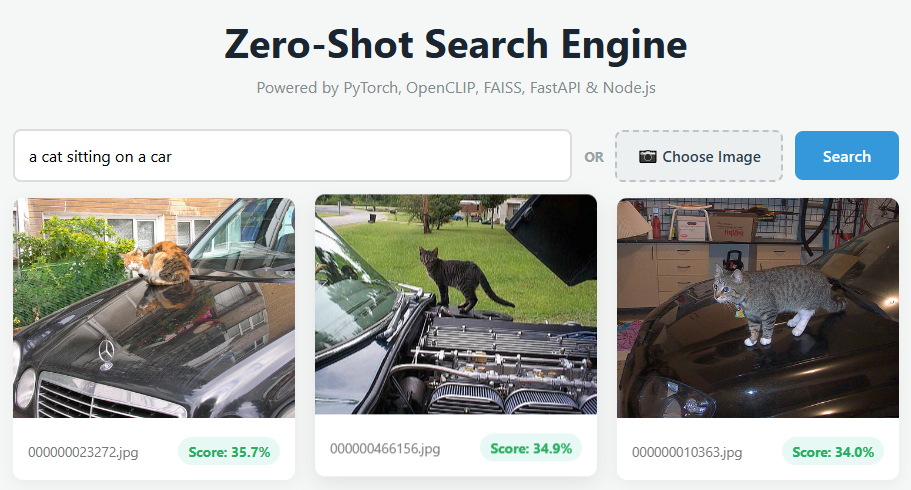
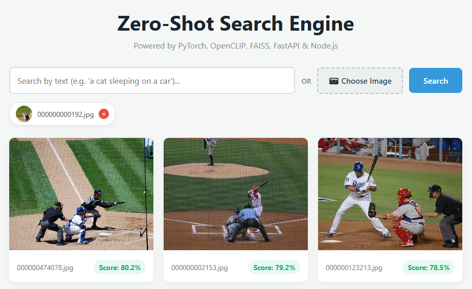

# Zero-Shot Search Engine

A Docker-containerized, multimodal visual search engine built with PyTorch, OpenCLIP, FAISS, FastAPI, and Node.js.

This application enables similarity search across unlabelled image databases using either natural language queries (Text-to-Image) or uploaded image files (Image-to-Image), requiring zero manual tagging or domain-specific fine-tuning (Zero-Shot).

## Tech Stack

* PyTorch & OpenCLIP (ViT-B-32): Powers deep learning inference and encodes both text queries and uploaded images into a shared 512-dimensional vector space.
* FAISS (IndexFlatIP): Performs sub-millisecond L2-normalized vector similarity search on CPU.
* FastAPI: Exposes asynchronous REST API endpoints and handles file uploads.
* Node.js / Express: Serves the responsive static web interface.
* Docker: Containerizes backend and frontend microservices with mounted persistent data volumes.

## How to Run

### Setup & Preprocessing
1. Clone repository

```bash
git clone https://github.com/M-Wanner/zero-shot-search-engine.git
cd zero-shot-search-engine
```

2. Place image data inside `/backend/data/images/`.
3. Run `extraction.ipynb` (GPU environment preferred) to generate `faiss_index.bin` and `image_paths.json` inside `backend/data/`.

### Option A: Docker Deployment
1. Execute docker compose in the project root directory.

```bash
docker compose up -d --build
```

2. Open the Frontend Web UI at `http://localhost:3000`.
3. To stop the program, run `docker compose down`.

### Option B: Manual Execution

1. Open terminal window for the backend
  1. Navigate to `/backend/`.
  2. Install Python requirements.
  3. Launch the server.

```bash
cd backend
python -m venv venv
source venv/bin/activate  # On Windows: venv\Scripts\activate
pip install -r requirements.txt
uvicorn main:app --reload --port 8000
```

5. Open second terminal window for the frontend
6. Navigate to `/frontend/`.
7. Install dependencies.
8. Start the static server.

```bash
cd frontend
npm install
node server.js
```

9. Open `http://localhost:3000` in your browser.

---

## Application Examples

The following examples demonstrate the tool generated from 5000 images of the MS COCO Validation Dataset.

### Text to Image Query Search
* Input: `a cat sleeping on a car`
* Output:


### Image to Image Query Search
* Input: `000000000192.jpg` from MS COCO Train dataset


* Output:



## License

Distributed under the [MIT License](LICENSE).